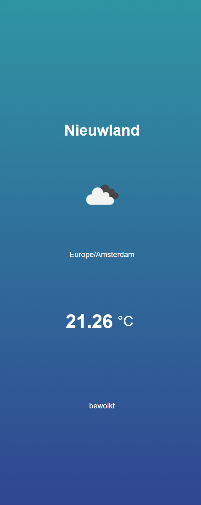
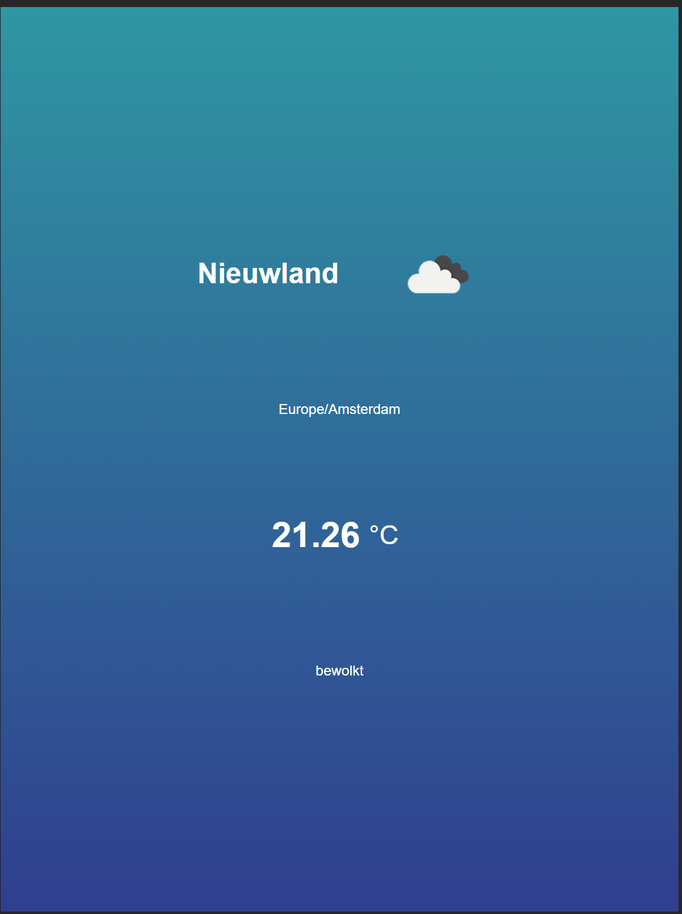

# Het weer

- [Het weer](#het-weer)
  - [Aan de slag](#aan-de-slag)
  - [Opdracht](#opdracht)
    - [API](#api)
    - [Tips](#tips)

## Aan de slag

```sh
git clone https://github.com/spike1292/syncasso-javascript-opdracht.git
cd javascript-opdracht
npm install
npm start
```

Open <http://localhost:1234>. Je ziet nu _Weer_ in de browser. Je kan nu aan slag met de opdracht.

## Opdracht

De pagina moet op basis van je huidige locatie de huidige temperatuur in Celcius en Fahrenheit weergeven. De pagina moet de volgende onderdelen tonen:
- Plaats
- Weer icoontje
- Tijdzone
- Temperatuur in Celcius
  - Wanneer je op de temperatuur klikt wisselen tussen Fahrenheit en Celcius
- Beschrijving van het huidige weer

Daarnaast zien we ook graag de naam van de plaat waar je bent en de huidige tijdzone.

Een aantal voorbeelden van het eindresultaat:

_Desktop_:


_Mobiel_:



_Tablet_:



_Fahrenheit_:


### API

Het huidige weer kan opgehaald worden bij de [OpenWeatherMap API](https://openweathermap.org/current)

Hier voor kan je de volgende API key gebruiken: `8ebf4f448fb0db23d24e285b5683d1bb`

De weer api geeft ook een id terug voor [een weer icoontje](https://openweathermap.org/current#list).
Je kunt met de volgende api het icoontje omzetten naar een plaatje: <https://openweathermap.org/weather-conditions>

### Tips

- Probeer zoveel mogelijk symantische html elementen te gebruiken
- Bij voorkeur CSS Flexbox en Grid gebruiken
- Probeer gebruik te maken van relatieve CSS units ipv. pixels
- Maak gebruik van `fetch` en `async/await`
- Om je huidige locatie op te halen gebruik `navigator.geolocation`
  - tip: wrap het in een promise zodat je het met `async/await` kunt gebruiken


